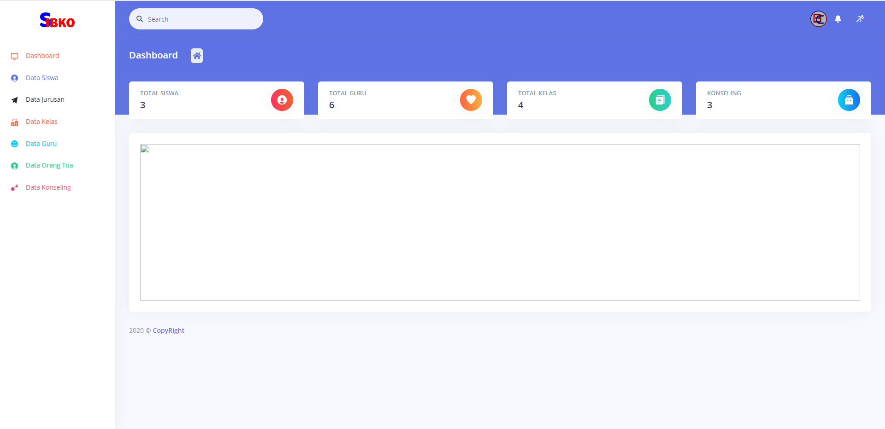
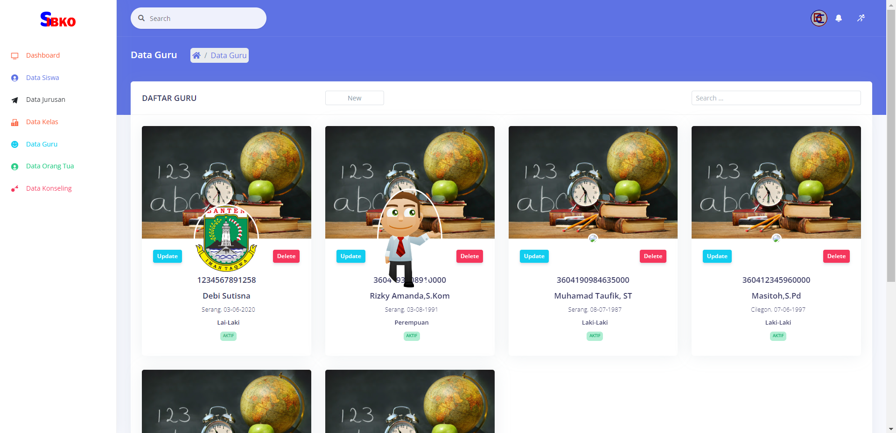
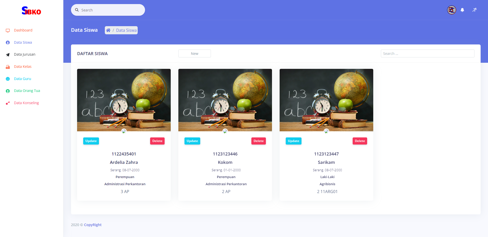
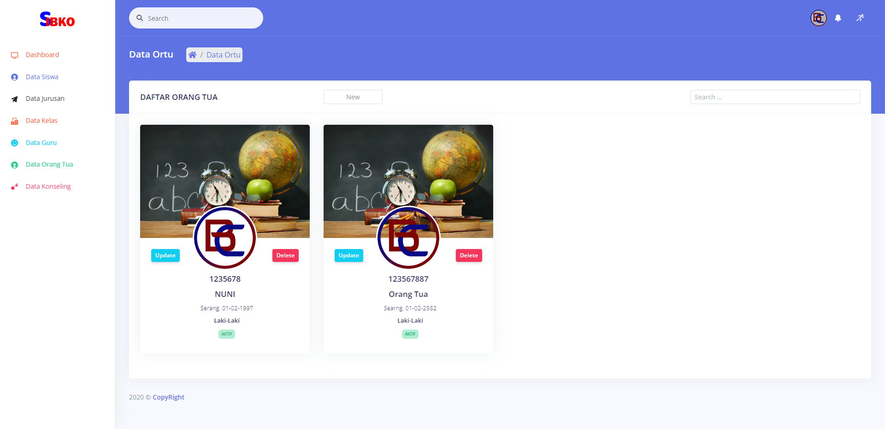
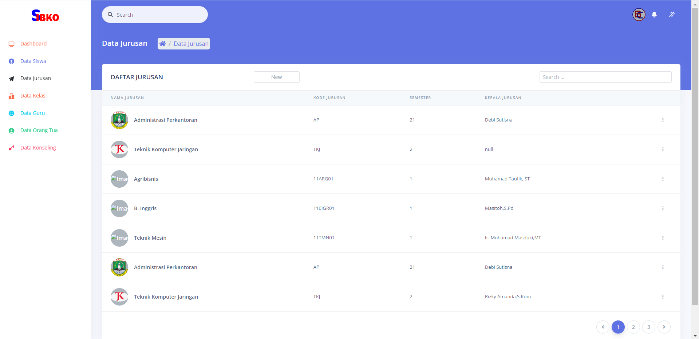
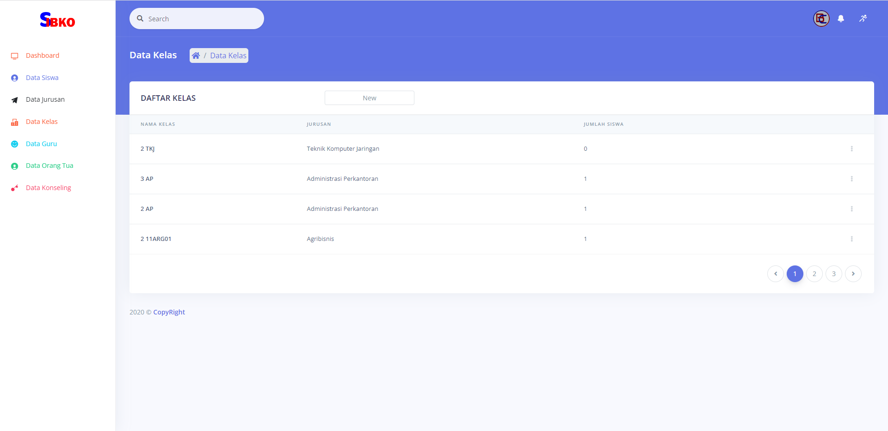
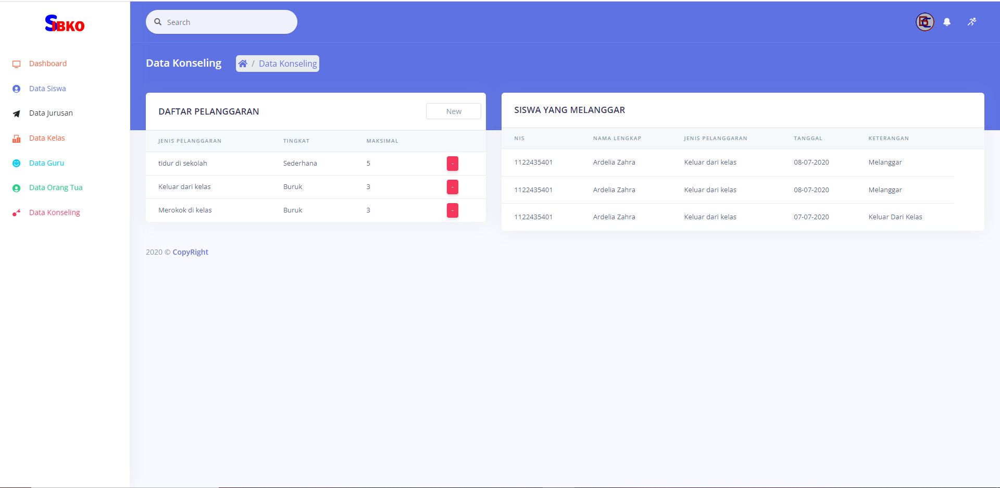
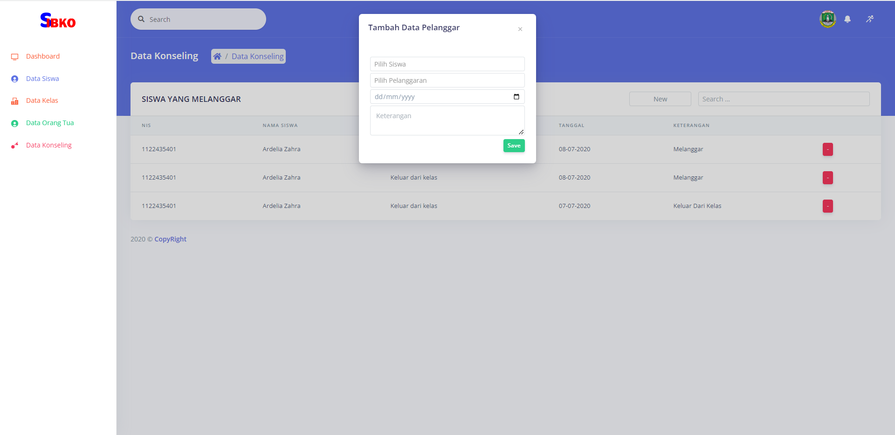

# Aplikasi Bimbingan Konseling (SIBKO)

Aplikasi ini dirancang untuk mencatat kegiatan konseling terhadap pelanggaran yang dilakukan oleh siswa. SIBKO memiliki berbagai fitur untuk membantu pencatatan dan manajemen data bimbingan konseling.

## Fitur

1. **Dashboard**: Ringkasan visual dari aktivitas konseling dan statistik penting.
2. **Data Guru**: Informasi dan manajemen data guru yang terlibat dalam konseling.
3. **Data Siswa**: Manajemen data siswa yang terdaftar di sekolah.
4. **Data Orang Tua**: Informasi dan manajemen data orang tua siswa.
5. **Data Jurusan**: Pengelolaan data jurusan di sekolah.
6. **Data Kelas**: Manajemen data kelas yang terdapat di sekolah.
7. **Data Konseling**: Pencatatan kegiatan konseling terhadap siswa.
8. **Data Konseling Guru**: Histori konseling yang dilakukan oleh setiap guru.

## Screenshot

### 1. Dashboard

### 2. Data Guru

### 3. Data Siswa

### 4. Data Orang Tua

### 5. Data Jurusan

### 6. Data Kelas

### 7. Data Konseling

### 8. Data Konseling Guru

## Instalasi

1. Clone repositori ini: `git clone https://github.com/inotechno/sibko.git`
2. Impor struktur database dari `database/sibko.sql`.
3. Konfigurasi file `application/config/database.php` untuk pengaturan koneksi database.

## Role Akses

1. **Admin**: Akses penuh ke semua fitur aplikasi.
2. **Guru**: Akses terbatas untuk melihat dan mencatat kegiatan konseling.
3. **Orang Tua**: Akses untuk melihat histori konseling yang dilakukan terhadap anaknya.
4. **Kepala Sekolah**: Akses terbatas sesuai dengan kebutuhan kepala sekolah.

## Kontribusi

Proyek ini terbuka untuk kontribusi. Jika Anda tertarik untuk berkontribusi atau melaporkan masalah, silakan buka issue atau pull request. Kami menyambut kontribusi Anda.

## Lisensi

Diberikan di bawah lisensi MIT - Lihat [LICENSE](LICENSE) untuk lebih lanjut.
